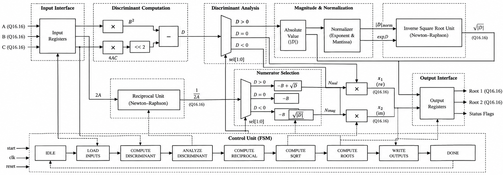
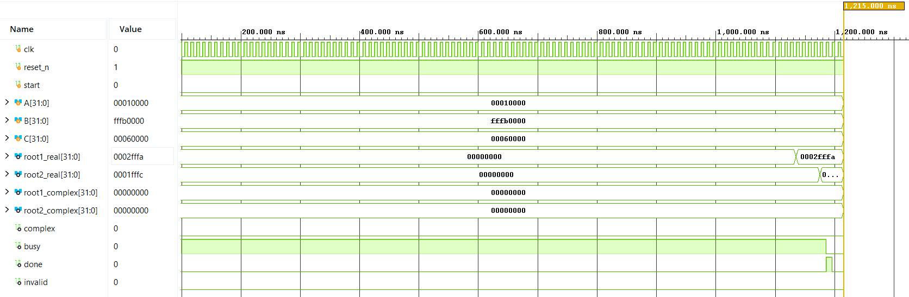

# FPGA-Based Quadratic Equation Solver

A fixed-point hardware accelerator that solves quadratic equations of the form

$$
Ax^2 + Bx + C = 0
$$

using the quadratic formula

$$
x = \frac{-B \pm \sqrt{B^2 - 4AC}}{2A}
$$

entirely in hardware, with no floating-point logic and no software processor involved. The design uses 32-bit signed Q16.16 fixed-point arithmetic and supports distinct real roots, repeated real roots, and complex-conjugate roots.

It was verified through RTL simulation, synthesized in Xilinx Vivado, and deployed on a Digilent ZedBoard (Zynq-7000 XC7Z020).

## Key Features

- **32-bit signed Q16.16 datapath** — two's-complement fixed-point arithmetic throughout
- **Real and complex roots** — handles distinct real, repeated real, and complex-conjugate cases
- **Newton-Raphson arithmetic** — reciprocal and inverse-square-root computed iteratively, no general-purpose divider
- **Dynamic normalization** — inputs normalized into a bounded range before iteration
- **Resource sharing** — a single shared multiplier serves all arithmetic stages
- **FSM-controlled datapath** — a multi-cycle FSM sequences the computation
- **Hardware-verified** — validated in simulation and on physical FPGA hardware, meeting timing at 100 MHz

## Mathematical Formulation

### 1. Discriminant

$$
D = B^2 - 4AC
$$

determines the computation path:

| Condition | Result |
|---|---|
| $D > 0$ | Two distinct real roots |
| $D = 0$ | One repeated real root |
| $D < 0$ | Two complex-conjugate roots |

For $D < 0$:

$$
x_{\text{real}} = \frac{-B}{2A}, \qquad x_{\text{imag}} = \frac{\sqrt{|D|}}{2A}
$$

### 2. Normalization

Inputs are normalized to the form

$$
|X| = m \cdot 2^E, \qquad 1 \leq m < 4
$$

using shifts, while the exponent $E$ is tracked separately. For square-root operations, $E$ is adjusted to be even, so that

$$
\sqrt{|X|} = \sqrt{m} \cdot 2^{E/2}
$$

### 3. Newton-Raphson Iteration

Division and square-root are both computed without a general-purpose divider.

**Reciprocal** ($y \to 1/m$):

$$
y_{n+1} = y_n(2 - m y_n)
$$

**Inverse square root** ($y \to 1/\sqrt{m}$):

$$
y_{n+1} = y_n\left(\frac{3}{2} - \frac{m y_n^2}{2}\right)
$$

The final reciprocal or square root is recovered by restoring the tracked exponent and multiplying.

### 4. Final Root Computation

$$
x_{1,2} = (-B \pm \sqrt{D}) \cdot \frac{1}{2A}
$$

For complex roots:

$$
x_{\text{real}} = (-B) \cdot \frac{1}{2A}, \qquad x_{\text{imag}} = \sqrt{|D|} \cdot \frac{1}{2A}
$$

## Hardware Architecture

A multi-cycle, FSM-controlled datapath with shared arithmetic resources:

- Discriminant unit
- Normalization unit
- Reciprocal unit (Newton-Raphson)
- Square-root unit (Newton-Raphson)
- Shared multiplier
- Control FSM



### RTL Simulation

Example simulation for $x^2 - 5x + 6 = 0$:



## Repository Structure

```text
.
├── rtl/
│   ├── quadratic_solver.v       # Top-level solver and control FSM
│   ├── discriminant.v           # Discriminant calculation
│   ├── normalization.v          # Fixed-point normalization
│   ├── reciprocal.v             # Newton-Raphson reciprocal
│   ├── sqrt.v                   # Inverse-square-root calculation
│   └── multiplier.v             # Shared fixed-point multiplier
├── tb/
│   └── ...                      # RTL testbenches
├── constraints/
│   └── zedboard.xdc             # FPGA pin and clock constraints
├── docs/
│   ├── architecture.png         # Hardware architecture diagram
│   ├── simulation.png           # RTL simulation waveform
│   └── schematic.pdf     # Vivado-generated schematic
└── README.md
```

## Verification

Each unit — normalization, reciprocal, square-root, and discriminant — was tested independently before integration. The complete solver was then tested end-to-end with real, repeated, and complex roots, including fractional coefficients and the invalid case $A = 0$.

**Representative test cases:**

| Equation | Expected Roots |
|---|---|
| $x^2 - 5x + 6 = 0$ | $3,\ 2$ |
| $x^2 + 4x + 4 = 0$ | $-2,\ -2$ |
| $2x^2 - 4x + 2 = 0$ | $1,\ 1$ |
| $x^2 + 1 = 0$ | $\pm j$ |
| $x^2 + 2x + 5 = 0$ | $-1 \pm 2j$ |
| $x^2 - 4x + 8 = 0$ | $2 \pm 2j$ |

All cases matched expected results within Q16.16 precision.

**Numerical results**, for $x^2 - 5x + 6 = 0$:

$$
x_1 = 2.999908, \qquad x_2 = 1.999939
$$

for $x^2 + 1 = 0$:

$$
x_1 = +j0.999969, \qquad x_2 = -j0.999969
$$

Small deviations from ideal values come from fixed-point quantization and truncation.

**Square-root unit, verified independently:**

| Input | Expected | Hardware |
|---|---|---|
| $24$ | $4.898979$ | $4.898987$ |
| $54$ | $7.348469$ | $7.348572$ |
| $2$ | $1.414214$ | $1.414215$ |

## FPGA Implementation

The design was synthesized and implemented in Xilinx Vivado, targeting the Digilent ZedBoard (Zynq-7000 XC7Z020).

**Resource utilization:**

| Resource | Used | Available | Utilization |
|---|---:|---:|---:|
| Slice LUTs | 2,309 | 53,200 | 4.34% |
| Slice Registers | 3,380 | 106,400 | 3.18% |
| Slices | 1,083 | 13,300 | 8.14% |
| DSPs | 16 | 220 | 7.27% |
| Bonded IOBs | 3 | 200 | 1.50% |

**Timing:** all constraints met at a 100 MHz clock, with a Worst Negative Slack (WNS) of **2.156 ns** and Total Negative Slack (TNS) of **0.000 ns**.

**Power:** estimated total on-chip power of **0.137 W** — 0.034 W dynamic, 0.103 W device static.

The low utilization and comfortable timing margin leave headroom for the pipelining and AXI-integration work described below.

## Hardware Demonstration

The bitstream was deployed on the physical ZedBoard and verified using Vivado VIO. Coefficients were supplied through VIO inputs, with computed roots and status signals observed through VIO outputs. The physical implementation reproduced the RTL simulation results, including real and complex roots and edge cases such as $D = 0$ and $A = 0$.

## Limitations

- **Fixed numerical range** — bounded by the 32-bit Q16.16 representation
- **Quantization error** — fixed-point truncation introduces small numerical errors
- **Iterative latency** — reciprocal and square-root calculations take multiple clock cycles
- **Shared multiplier** — reduces hardware usage at the cost of added latency
- **$A = 0$** — flagged as invalid rather than handled as a linear equation
